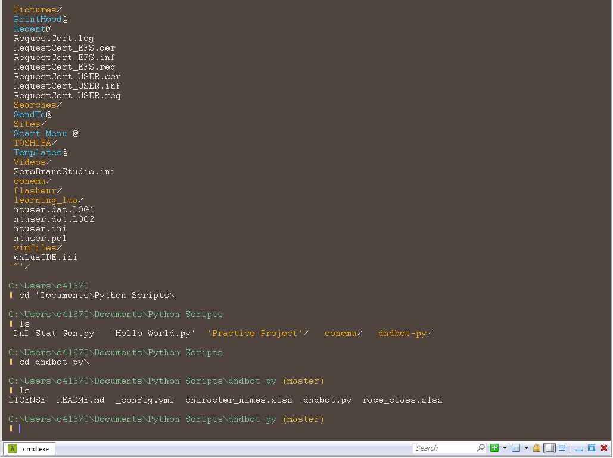

# Pop!_Theme for [ConEmu](http://conemu.github.io)

> A flat theme for [ConEmu](http://conemu.github.io) based on Pop_OS! by System76.

## Install

All instructions can be found at [draculatheme.com/conemu](https://draculatheme.com/conemu), just substitute in the values found in [Pop!_Theme.xml](./Pop!_Theme.xml).

## Build

Provided is a theme generating script. Please read `gen_theme.py` if you want
to make some modifications. It will be really easy to change colors in the palette,
and run `python gen_theme.py > themeName.xml` to generate a theme.

## Resources

The readme and base files for this theme came from [Dracula Theme (Conemu)](https://github.com/dracula/conemu)

The color values from this theme come from [VsCodePopTheme](https://github.com/artvandelay440/VSCodePopTheme).

## License

[MIT License](./LICENSE)
